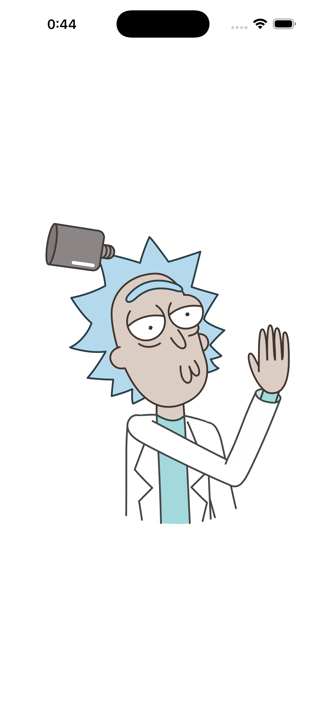
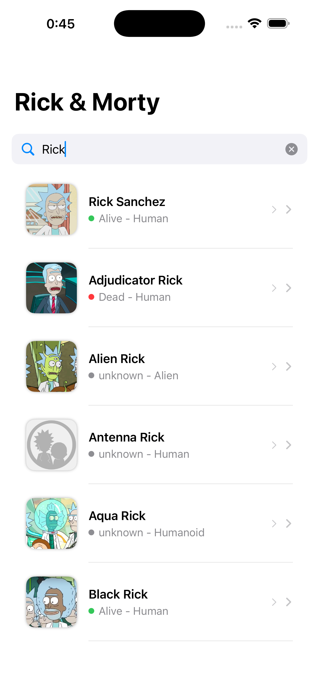
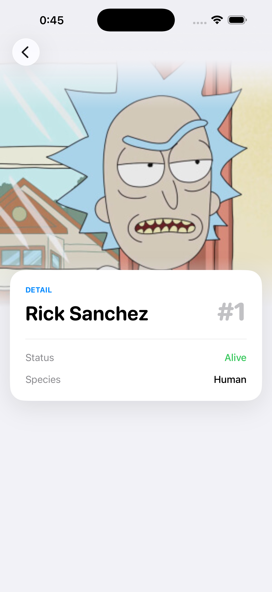

# Rick & Morty App - iOS Technical Challenge

Esta aplicación es una implementación robusta en **SwiftUI** que consume la API de Rick & Morty. El proyecto demuestra buenas prácticas de **Clean Architecture**, manejo de **concurrencia moderna** y optimización mediante un sistema de **caché de memoria**.

## 📋 Requisitos Técnicos Cumplidos

### Arquitectura (Clean Architecture)
El proyecto está estructurado en capas independientes para garantizar la escalabilidad y testabilidad:
* **Presentation Layer**: Implementada con **MVVM** y estados reactivos (`idle`, `loading`, `success`, `error`).
* **Domain Layer**: Contiene las entidades (`Character`) y los casos de uso independientes de frameworks.
* **Data Layer**: Gestiona la lógica de datos mediante el repositorio, comunicando con la API y el sistema de caché.

### Gestión de Caché (Performance)
* **Caché en Memoria**: Almacenamiento por *query* con un tiempo de expiración configurable (2-5 minutos).
* **Ahorro de Red**: Si existe un resultado válido en caché, se devuelve instantáneamente sin realizar llamadas de red.
* **Expiración**: El sistema invalida automáticamente los datos tras el TTL (Time To Live) definido, refrescando desde la red cuando es necesario.

### Concurrencia y Asincronía
* **Cancelación de Tareas**: La lógica de búsqueda cancela automáticamente las peticiones previas si el usuario inicia una nueva antes de que la anterior finalice.
* **Swift Concurrency**: Uso extensivo de `async/await` y gestión de tareas mediante `Task`.

## 🧪 Estrategia de Testing
Se han incluido tests robustos utilizando el nuevo framework **Swift Testing**:
* **Domain Tests**: Validación de lógica de negocio mediante mocks del repositorio.
* **Data Tests**: Verificación del comportamiento del caché y llamadas de red.
* **Presentation Tests**: Comprobación de la cancelación de tareas en el ViewModel ante ráfagas de búsqueda.

## 📱 Funcionalidades
1. **Buscador Reactivo**: Campo de texto que filtra personajes en tiempo real.
2. **Pantalla de Detalle**: Muestra información relevante: ID, Estatus y Especie.
3. **UI Dinámica**: Feedback visual mediante animaciones Lottie (Loading), Portal (Idle) y Jerry (Error/No results).

## 📸 Capturas de Pantalla

| Estado Inicial | Lista de Resultados | Detalle |
|:---:|:---:|:---:|
|  |  |  |

| Cargando | Sin Resultados |
|:---:|:---:|
|  |  |

---

## 🛠️ Stack Tecnológico
* **SwiftUI** (100%)
* **URLSession** para Networking
* **Lottie** para animaciones fluidas
* **Swift Testing** para pruebas unitarias e integración
